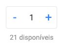

## Desafio Javascript - 01

Vamos replicar o carrinho de compras do e-commerce Mercado Livre de 2020.

[Veja aqui o resultado esperado desse desafio](https://codelabs.pro/desafio-javascript-01/index.html)

## :fire: Checklist

1. Crie o campo para mostrar a quantidade de produtos.
2. Crie o botão de `Menos` e `Mais`.
3. Crie o texto `21 disponíveis`.
4. Altere o css para a quantidade ficar próximo da imagem abaixo:

5. Quando clicar no botão `Menos`, o valor da quantidade deve diminuir em 1.
6. Quando clicar no botão `Mais`, o valor da quantidade deve aumentar em 1.
7. Quando a quantidade for alterada, mude o título do carrinho para ele mostrar o número total de produtos corretamente.

## :trollface: Achou fácil?

Terminou o checklist sem muita dificuldade? Deixei mais alguns itens para você se desafiar e complementar o seu código.

1. Não deixe o número da quantidade ficar menor que zero.
1. Não deixe o número da quantidade ficar maior que a quantidade disponível.
1. Quando alterar a quantidade, atualize o valor total do produto. ex: 1 produto = R$10, 2 produtos = R$20
1. Coloque dois produtos diferentes no mesmo carrinho.

## :eyes: Referências

- [Google Fonts](https://fonts.google.com/)
- [Mozilla web docs](https://developer.mozilla.org/)
- [w3schools](https://www.w3schools.com)
- [Devmedia](https://www.devmedia.com.br)

## 🤔 Dúvidas?

### Como começo o meu desafio?

Nesse vídeo mostrei como iniciar qualquer um dos desafios desse repositório, [vídeo aqui!](https://www.youtube.com/watch?v=Vph1CUip0ik).

Busque os comentários `Seu código aqui`, para saber por onde começar o seu código.

### Porque já tem alguns arquivos dentro desse desafio?

O projeto já vem com uma pré-configuração para o desafio ficar focado apenas no conteúdo proposto.

Veja abaixo quais são essas pré-configurações:

- Todo o código do desafio fica e deve ficar dentro da pasta `src`.
- Todas as imagens necessárias para o desafio estão dentro da pasta `assets`.
- Criei e pré-configurei os arquivos `html`, `css`, `sass` e `javascript`. Todos já estão vinculados.
- Adicionei comentários `Seu código aqui`, para indicar por onde você deve começar o seu código.

### Como ver o resultado do meu código?

1. Instale no seu [Visual Studio Code](https://code.visualstudio.com/) a extensão [Live Server](https://marketplace.visualstudio.com/items?itemName=ritwickdey.LiveServer).
1. Clicando com o botão direito no seu arquivo `index.html` aberto, escolha a opção `Open with Live Server`.
1. Instale no seu `Visual Studio Code` a extensão [Live Sass Compiler](https://marketplace.visualstudio.com/items?itemName=ritwickdey.live-sass).
1. Para ativar o Sass lembre de clicar em `Watch Sass` que fico no rodapé do seu `Visual Studio Code`

## :page_facing_up: Licença

Esse projeto está sob a licença MIT. Veja o arquivo [LICENSE](/LICENSE) para mais detalhes.

---

Criado por [Eric Havel](https://www.linkedin.com/in/eric-havel-9a22b118/)
